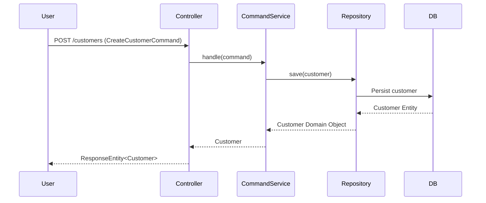
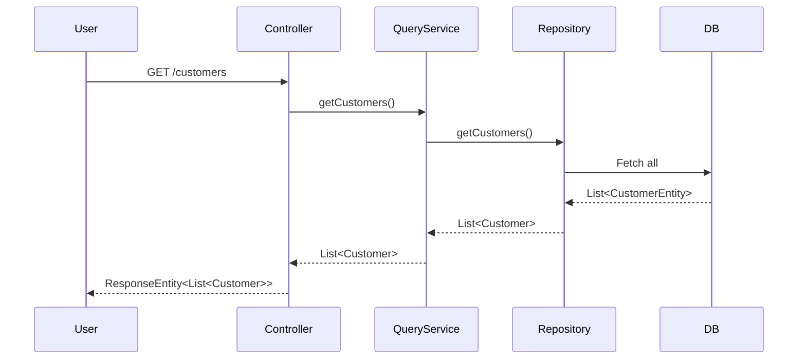
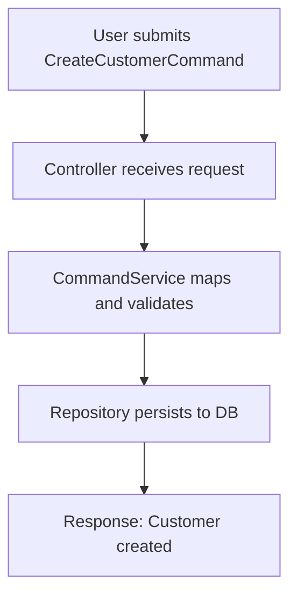
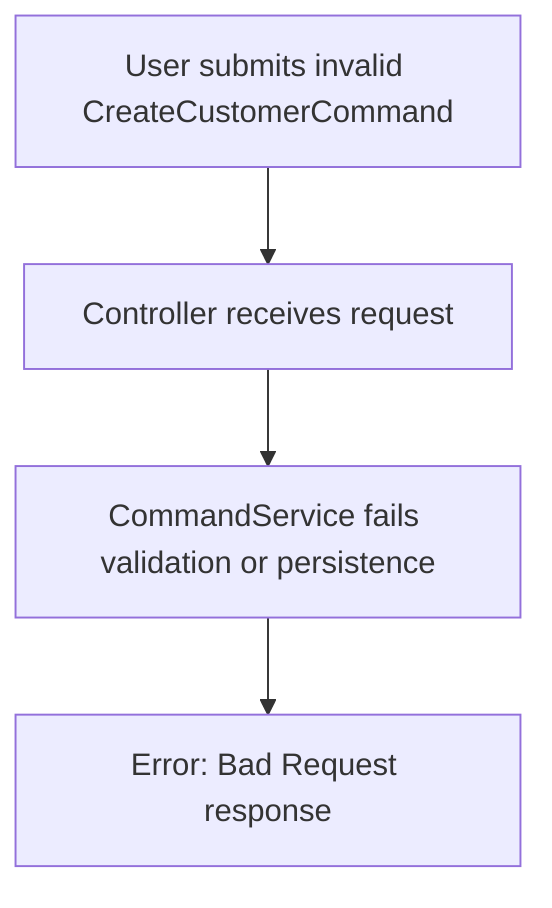

# Copilot Agile Task Estimation - Documentation

## Overview

This project is a Java Spring Boot application designed to manage customer-related tasks and automate their estimation processes in an agile environment. It leverages reactive programming (Project Reactor), R2DBC for non-blocking database operations, and follows a clean layered architecture.

---

## Technology Stack

- **Java 17+**
- **Spring Boot**
- **Spring WebFlux** (reactive REST API)
- **R2DBC** (Reactive Relational Database Connectivity)
- **Lombok** (for reducing boilerplate)
- **MapStruct** (for object mapping)
- **Project Reactor** (`Mono`, `Flux`)
- **Layered architecture**: Controllers, Services, Repositories.

---

## Main Business Logic

### Customer Management

- **Create a Customer:** Accepts customer information and persists it.
- **Get Customers:** Retrieves all registered customers.
- **Repository Pattern:** Abstracts data access, enabling switching between storage mechanisms.

### Estimation Process

While the domain refers to "agile task estimation," the provided code is focused on customer creation and querying. However, the architecture is extensible for other entities and estimation logic.

---

## Main Functions and Their Relationships

### Services

- **CustomerCommandService**: Handles commands (e.g., creating customers).
  - Implemented by `CustomerCommandServiceImpl`
  - Uses repository and mapper to persist new customers.

- **CustomerQueryService**: Handles queries (e.g., fetching customers).
  - Implemented by `CustomerQueryServiceImpl`
  - Retrieves customer lists from the repository.

### Repositories

- **CustomerRepository (Interface):**
  - `getCustomers()`: Returns all customers.
  - `findCustomerById(UUID id)`: Find by ID.
  - `findCustomerByName(String name)`: Find by name.
  - `save(Customer customer)`: Persists a customer.

- **CustomerRepositoryImpl**
  - Implements above methods using an R2DBC repository (`CustomerR2dbcRepository`) and `CustomerMapper` for conversion.
- **CustomerR2dbcRepository**
  - Extends `R2dbcRepository` for persistence.
  - Custom finder by `fullName`.

### REST Endpoints

- **GET /customers**
  - Returns a list of customers.
- **POST /customers**
  - Creates a new customer from a request body command.

### Controller

- **CustomerController**
  - Handles HTTP requests for customer resources.
  - Delegates to query/command services.
  - Handles error responses gracefully.

---

## Example Endpoint Usage

| Method | Endpoint        | Request Body                | Response             |
|--------|----------------|----------------------------|----------------------|
| GET    | `/customers`   | -                          | List of Customers    |
| POST   | `/customers`   | `CreateCustomerCommand`     | Created Customer     |

---

## Mermaid Diagrams

### Workflow: Customer Creation

### Workflow: Retrieve Customers

### Happy Path (Customer Creation)

### Alternate Path (Error Handling)

---

## Extensibility

The architecture allows for easy extension to other domains (e.g., Tasks, Estimations):
- Add new services, repositories, and controllers using the same patterns.
- Implement additional endpoints for estimation logic (e.g., `/tasks`, `/estimations`).

---

## References

- [View all service files](https://github.com/JCayllahuaG/copilot-agile-task-estimation/search?q=service)
- [View all repository files](https://github.com/JCayllahuaG/copilot-agile-task-estimation/search?q=repository)
- [View all controller files](https://github.com/JCayllahuaG/copilot-agile-task-estimation/search?q=controller)

---

## Summary

This project provides a robust, reactive, and extensible backend for customer management and agile task estimation. Its layered structure, separation of concerns, and modern Java/Spring technologies make it suitable for scalable enterprise applications.

If you need further details about a specific file or logic, visit the [GitHub repository](https://github.com/JCayllahuaG/copilot-agile-task-estimation).
